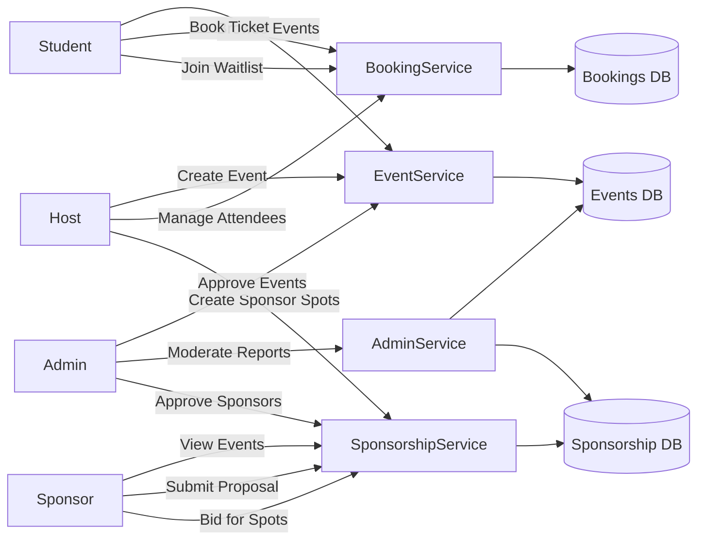
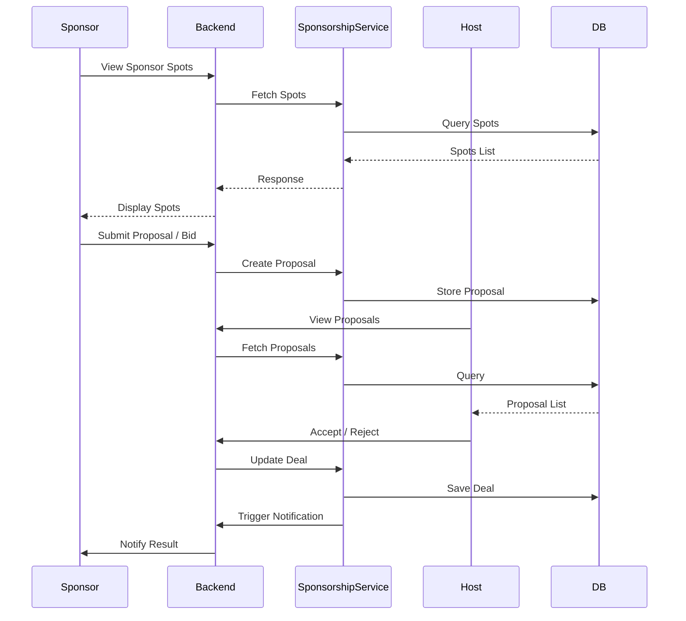
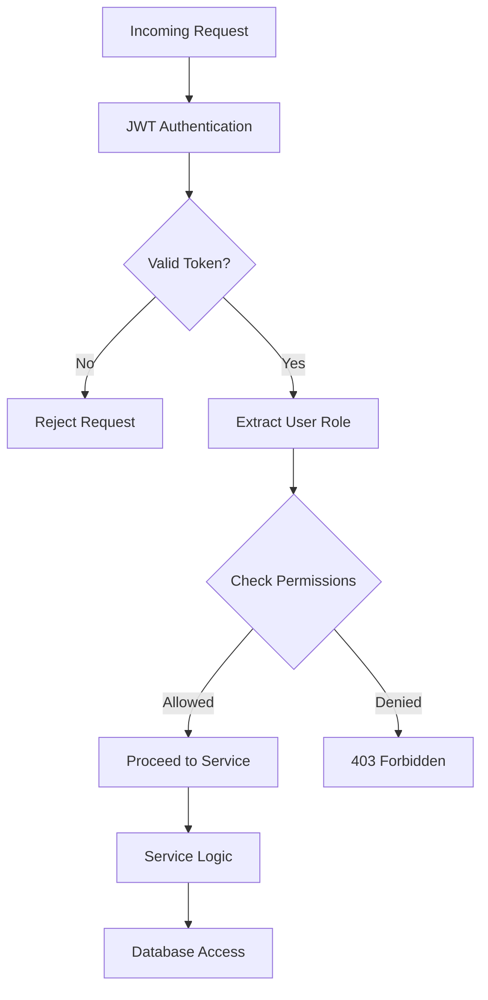
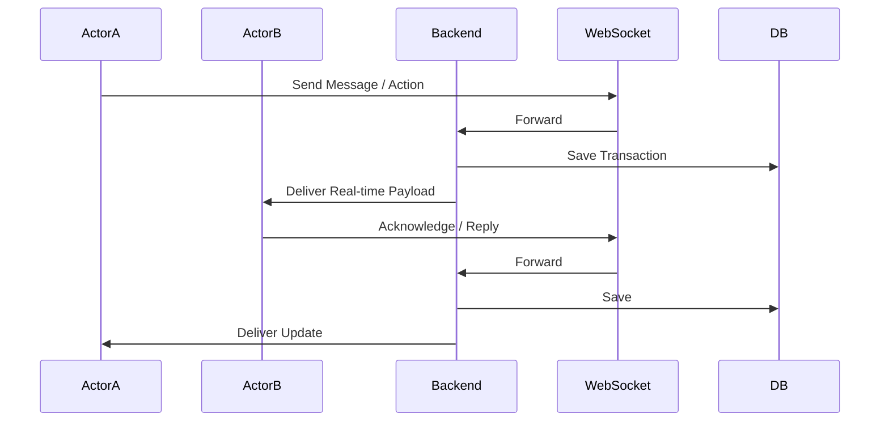

# 🎟️ EventHub — Campus Event Discovery & Ticketing Platform

> A full-stack event booking platform for college campuses featuring secure QR-based ticket verification, real-time notifications, community engagement, and sponsorship management.

[](https://react.dev)
[](https://expressjs.com)
[](https://www.sqlite.org)
[](https://www.typescriptlang.org)

---

## 📑 Table of Contents

- [Features](#-features)
- [Architecture Overview](#-architecture-overview)
- [Folder Structure](#-folder-structure)
- [Getting Started](#-getting-started)
- [Environment Variables](#-environment-variables)
- [Database Schema](#-database-schema)
- [API Endpoint Reference](#-api-endpoint-reference)
- [Authentication & Roles](#-authentication--roles)
- [QR Ticket Verification System](#-qr-ticket-verification-system)
- [WebSocket Real-Time Events](#-websocket-real-time-events)
- [Test Credentials](#-test-credentials)
- [Design System](#-design-system)
- [Contributing](#-contributing)

---

## ✨ Features

| Category | Features |
|----------|----------|
| **Events** | Browse, search (FTS5), filter by category/venue/date, create, edit, duplicate, recurring events |
| **Tickets** | Multi-tier ticket types, QR code generation, secure JWT-signed QR tokens, real-time verification |
| **Scanner** | Camera-based QR scanner (Html5Qrcode), manual fallback, scan history, live attendance stats |
| **Communities** | Create/join communities, discussion threads, real-time messaging |
| **Sponsorship** | Sponsor spots, bidding system, deal management, sponsorship analytics |
| **Social** | Follow/unfollow system, user profiles, wishlist, event sharing |
| **Admin** | Event approval/rejection, content moderation, reports, platform-wide attendance tracking |
| **Real-Time** | WebSocket notifications, live ticket verification status, chat messaging |
| **PWA** | Progressive Web App support with offline capabilities |

---

## 🏗️ Architecture Overview

The EventHub system is architected as a high-performance, real-time event orchestration platform. Below is the end-to-end system flow depicting service interactions and data routing.

### 🧠 1. System Flow (End-to-End)

```mermaid
flowchart TD

%% CLIENT LAYER
A[Client App (Student / Host / Sponsor / Admin)]

%% ENTRY
A --> B[API Gateway / Backend Server]

%% AUTH
B --> C[Auth Service]
C --> D{Role Check}

%% ROLE ROUTING
D -->|Student| E[Booking Service]
D -->|Host| F[Event Service]
D -->|Sponsor| G[Sponsorship Service]
D -->|Admin| H[Admin Moderation Service]

%% CORE SERVICES
F --> I[(Events DB)]
E --> J[(Bookings DB)]
G --> K[(Sponsorship DB)]
H --> I
H --> K

%% CROSS-SERVICE
F --> G
E --> F

%% MESSAGING
G --> L[Messaging Service]
L --> M[(Messages DB)]

%% NOTIFICATIONS
E --> N[Notification Service]
F --> N
G --> N
N --> O[(Notifications DB)]

%% CACHE
B --> P[(Redis Cache)]

%% EXTERNAL
B --> Q[Payments API]
B --> R[Maps API]
B --> S[Email/SMS Service]
```

### 🧩 2. Detailed Role Interaction Flow

Describes how different user personas interact with the core domain services.



**Key Technologies:**
- **Frontend:** React 19, Vite 6, TailwindCSS v4, Motion (Framer Motion), Recharts, Lucide Icons
- **Backend:** Express 4, better-sqlite3, jsonwebtoken, bcryptjs, multer, qrcode
- **Real-Time:** ws (WebSocket), Html5Qrcode (camera scanner)
- **Tooling:** TypeScript 5.7, ESLint, PostCSS

---

## 📁 Folder Structure

```
event-hub/
├── 📄 server.ts              # Express API server + WebSocket + Vite middleware
├── 📄 db.ts                   # SQLite schema, migrations, seed data
├── 📄 vite.config.ts          # Vite configuration (proxy, PWA, aliases)
├── 📄 package.json            # Dependencies and scripts
├── 📄 tsconfig.json           # TypeScript configuration (app)
├── 📄 tsconfig.node.json      # TypeScript configuration (server/build)
├── 📄 tailwind.config.ts      # TailwindCSS v4 configuration
├── 📄 postcss.config.js       # PostCSS plugins
├── 📄 .env.example            # Environment variable template
├── 📄 index.html              # SPA entry point
│
├── 📂 src/                    # Frontend source
│   ├── 📄 App.tsx             # Main application (all pages & components)
│   ├── 📄 main.tsx            # React entry point
│   ├── 📄 index.css           # Global styles & design tokens
│   ├── 📄 types.ts            # TypeScript interfaces & types
│   ├── 📄 vite-env.d.ts       # Vite type declarations
│   └── 📂 features/
│       └── 📂 sponsorship/
│           └── 📄 api.ts      # Sponsorship API helpers
│
├── 📂 public/                 # Static assets
│   └── 📄 vite.svg            # Default Vite icon
│
├── 📂 uploads/                # User-uploaded images (event posters)
│
├── 📂 EVENT-HUB-PAPERS/       # Project documentation & papers
│
└── 📂 data/                   # SQLite database files (auto-created)
    └── 📄 eventhub.db         # Main database
```

### Key Files

| File | Lines | Purpose |
|------|-------|---------|
| `server.ts` | ~3,843 | Complete REST API with 60+ endpoints, auth middleware, WebSocket server, rate limiting |
| `db.ts` | ~979 | Database schema (20+ tables), indexes, seed data for all features |
| `src/App.tsx` | ~4,940 | Entire React SPA — 22+ page components, navigation, theme system |
| `src/types.ts` | ~319 | TypeScript interfaces for all data models |
| `src/index.css` | — | "Nocturnal Architect" design system tokens and utility classes |

---

## 🚀 Getting Started

### Prerequisites

- **Node.js** ≥ 18
- **npm** ≥ 9

### Installation

```bash
# Clone the repository
git clone <repo-url>
cd event-hub

# Install dependencies
npm install

# Copy environment variables
cp .env.example .env
# Edit .env and set a strong JWT_SECRET
```

### Development

```bash
# Start the development server (Express + Vite HMR)
npm run dev
```

The app will be available at **http://localhost:3000**.

### Production Build

```bash
# Build the frontend
npm run build

# Start in production mode
NODE_ENV=production node server.ts
```

---

## 🔑 Environment Variables

| Variable | Required | Default | Description |
|----------|----------|---------|-------------|
| `JWT_SECRET` | ✅ | — | Secret key for signing JWT auth tokens and QR payloads |
| `GEMINI_API_KEY` | ❌ | `""` | Google Gemini API key (reserved for AI features) |
| `APP_URL` | ❌ | `http://localhost:3000` | Base URL for the application |
| `DISABLE_HMR` | ❌ | `false` | Disable Vite hot module reload |

---

## 🗄️ Database Schema

The SQLite database contains **20+ tables**. Key tables:

### Core Tables

| Table | Purpose | Key Fields |
|-------|---------|------------|
| `users` | User accounts | `id`, `username`, `email`, `password_hash`, `role`, `avatar` |
| `events` | Event listings | `id`, `name`, `date`, `venue`, `host_id`, `status`, `total_seats` |
| `bookings` | Ticket purchases | `id`, `user_id`, `event_id`, `booking_ref`, `quantity`, `total_price`, `qr_code` |
| `tickets` | Individual tickets | `ticket_id`, `booking_id`, `event_id`, `user_id`, `status`, `verification_status`, `qr_token` |
| `ticket_types` | Ticket tiers (VIP, General) | `id`, `event_id`, `name`, `price`, `quantity` |
| `categories` | Event categories | `id`, `name`, `icon` |

### Social & Community Tables

| Table | Purpose |
|-------|---------|
| `communities` | User-created groups |
| `community_members` | Membership tracking |
| `community_posts` | Community feed posts |
| `community_messages` | Real-time chat messages |
| `follows` | User follow/follower relationships |
| `discussions` | Event discussion threads |
| `wishlists` | Saved/bookmarked events |

### Sponsorship Tables

| Table | Purpose |
|-------|---------|
| `sponsors` | Sponsor company profiles |
| `sponsor_spots` | Sponsorship slots within events |
| `bids` | Auction-style sponsorship bids |
| `sponsorship_requests` | Host-to-sponsor outreach |
| `deals` | Finalized sponsorship agreements |
| `deal_messages` | Deal negotiation chat |

### System Tables

| Table | Purpose |
|-------|---------|
| `notifications` | Push notification queue |
| `reports` | Content moderation reports |
| `event_faqs` | Event FAQ entries |
| `event_analytics_snapshots` | Historical analytics data |

### 💼 3. Sponsorship + Bidding Workflow

EventHub features a unique sponsorship bidding system that allows local businesses to compete for visibility at high-traffic campus events.



---

## 📡 API Endpoint Reference

### Authentication

| Method | Endpoint | Auth | Description |
|--------|----------|------|-------------|
| `POST` | `/api/register` | ❌ | Register new user |
| `POST` | `/api/login` | ❌ | Login (returns JWT + user) |

### Events

| Method | Endpoint | Auth | Description |
|--------|----------|------|-------------|
| `GET` | `/api/events` | ❌ | List all approved events (with search, filter, pagination) |
| `GET` | `/api/events/:id` | ❌ | Get event details |
| `POST` | `/api/events` | Host | Create event (multipart form with image) |
| `PUT` | `/api/events/:id` | Host | Update event |
| `DELETE` | `/api/host/events/:id` | Host | Delete event |
| `POST` | `/api/events/:id/duplicate` | Host | Duplicate event |
| `POST` | `/api/events/:id/recurring` | Host | Schedule recurring instances |

### Tickets & Verification

| Method | Endpoint | Auth | Description |
|--------|----------|------|-------------|
| `POST` | `/api/bookings` | User | Book tickets (generates QR code) |
| `GET` | `/api/bookings/user/:userId` | Self/Admin | Get user's bookings |
| `GET` | `/api/tickets/user/:userId` | Self/Admin | Get user's tickets |
| `POST` | `/api/tickets/verify` | Host/Admin | Verify ticket via QR scan |
| `POST` | `/api/tickets/verify-manual` | Host/Admin | Manual verification by ID/email |
| `GET` | `/api/ticket-status` | Auth | Check ticket verification status |
| `GET` | `/api/events/:id/attendees` | Host/Admin | List event attendees |
| `GET` | `/api/events/:id/tickets/summary` | Host/Admin | Attendance statistics |

### Admin

| Method | Endpoint | Auth | Description |
|--------|----------|------|-------------|
| `GET` | `/api/admin/events/pending` | Admin | List pending events |
| `POST` | `/api/admin/events/:id/approve` | Admin | Approve event |
| `POST` | `/api/admin/events/:id/reject` | Admin | Reject event |
| `DELETE` | `/api/admin/events/:id` | Admin | Force-delete event |
| `GET` | `/api/admin/reports` | Admin | List content reports |

### Communities & Social

| Method | Endpoint | Auth | Description |
|--------|----------|------|-------------|
| `GET` | `/api/communities` | ❌ | List all communities |
| `POST` | `/api/communities` | Auth | Create community |
| `POST` | `/api/communities/:id/join` | Auth | Join community |
| `POST` | `/api/follow/:id` | Auth | Follow a user |
| `GET` | `/api/notifications` | Auth | Get user notifications |

---

## 🔐 Authentication & Roles

EventHub uses **JWT-based authentication** with bcrypt password hashing.

### Roles

| Role | Capabilities |
|------|-------------|
| **`student`** | Browse events, book tickets, join communities, follow users |
| **`host`** | All student perms + create/manage events, scan tickets, view attendees |
| **`admin`** | All perms + approve/reject events, manage reports, platform-wide access |
| **`sponsor`** | Sponsor dashboard, place bids, manage deals |

### Auth Flow

1. User registers → password hashed with `bcryptjs`
2. User logs in → server returns JWT token + user object
3. Client stores token in `localStorage` as `authToken`
4. All authenticated requests include `Authorization: Bearer <token>` header
5. Server middleware (`requireAuth`, `requireRole`) validates JWT and enforces access control

### ⚙️ 5. RBAC (Authorization Flow)



---

## 📱 QR Ticket Verification System

### Flow

```
Student Books Ticket → QR Code Generated (JWT-signed) → Host Scans at Gate
     │                        │                              │
     ▼                        ▼                              ▼
  Booking created      qrcode library generates        Html5Qrcode camera
  in database          data URL with JWT payload       reads QR → POST /api/tickets/verify
                                                             │
                                                             ▼
                                                     Server verifies JWT signature,
                                                     checks ticket status, updates DB
                                                             │
                                                             ▼
                                                     WebSocket broadcasts
                                                     "ticket_verified" to user
```

### QR Payload Structure

```json
{
  "typ": "event_ticket",
  "v": 1,
  "ticketId": "TKT-ABC123",
  "eventId": "evt-456",
  "userId": "usr-789",
  "iat": 1711929600,
  "exp": 1714521600
}
```

### Security Features

- **JWT-signed tokens** — tamper-proof QR payloads
- **Rate limiting** — prevents brute-force scanning
- **Idempotent verification** — duplicate scans return `alreadyCheckedIn: true`
- **Role-based access** — only Host/Admin can verify tickets
- **Event scope validation** — ticket must match the scanned event

---

## 🔌 WebSocket Real-Time Events

The server broadcasts these WebSocket events:

| Event Type | Payload | Recipients |
|------------|---------|------------|
| `ticket_verified` | `{ ticket, event }` | Ticket owner, Host, Admin |
| `new_notification` | `{ notification }` | Target user |
| `new_message` | `{ message }` | Community members |
| `booking_created` | `{ booking }` | Host of the event |

### Client Connection

```typescript
const protocol = window.location.protocol === 'https:' ? 'wss:' : 'ws:';
const socket = new WebSocket(`${protocol}//${window.location.host}?userId=${userId}`);
socket.onmessage = (event) => {
  const payload = JSON.parse(event.data);
  // Handle payload.type
};
```

### 💬 Real-Time Messaging & Sync Flow



---

## 🧪 Test Credentials

The database is seeded with these test accounts:

| Role | Email | Password |
|------|-------|----------|
| **Student** | `student@college.com` | `admin123` |
| **Host** | `host@college.com` | `admin123` |
| **Admin** | `admin@college.com` | `admin123` |
| **Sponsor** | `sponsor@college.com` | `admin123` |

> ⚠️ These are development-only credentials. Never use in production.

---

## 🎨 Design System

EventHub uses the **"Nocturnal Architect"** design system:

- **Theme:** Premium dark mode with light mode toggle
- **Primary Color:** Brand green (`hsl(var(--brand-500))`)
- **Typography:** `font-display` (bold uppercase) + `font-serif` (italic accents)
- **Components:** Glass morphism (`.glass`), luxury inputs (`.input-luxury`), `.btn-luxury` buttons
- **Micro Labels:** `.micro-label` — uppercase tracking-widest small labels
- **Cards:** `.rounded-[3rem]` with subtle border and shadow

---

## 🤝 Contributing

1. **Fork** the repository
2. **Create** a feature branch: `git checkout -b feature/my-feature`
3. **Commit** your changes: `git commit -m "Add my feature"`
4. **Push** to the branch: `git push origin feature/my-feature`
5. **Open** a Pull Request

### Code Style

- All frontend code lives in `src/App.tsx` (monolith SPA)
- Backend API routes are in `server.ts`
- Follow the existing "Nocturnal Architect" design patterns
- Use TypeScript strict mode
- Add proper error handling for all API calls

---

## 📄 License

This project is built for educational purposes as a college event management platform.

---

<p align="center">Built with ❤️ for campus life — EventHub © 2026</p>
