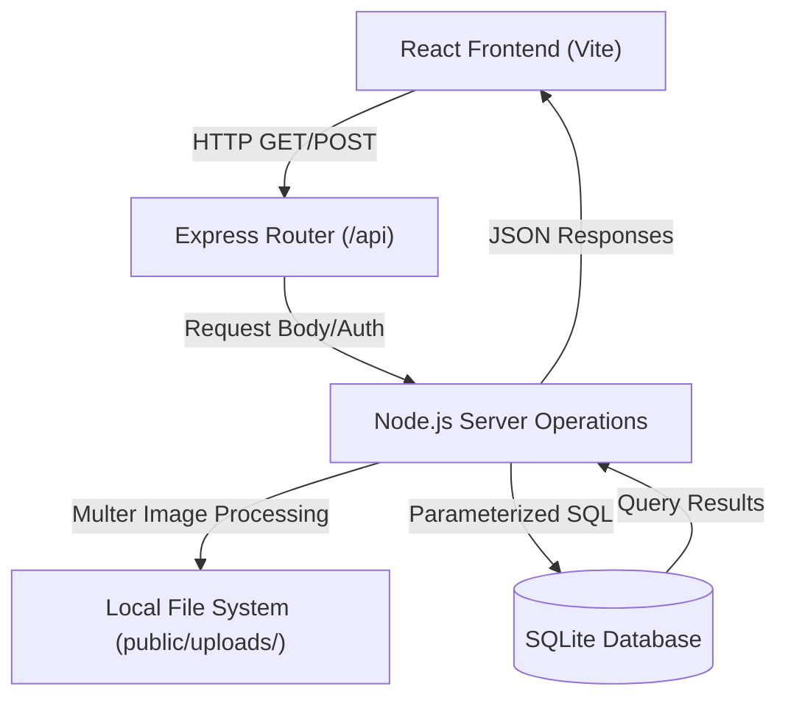
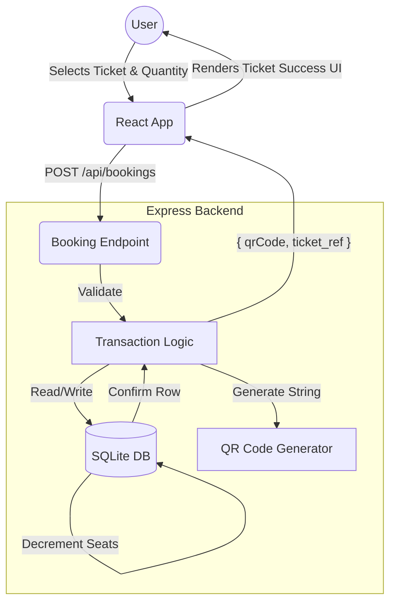

# EventHub 🎫

[](https://vitejs.dev/)
[](https://reactjs.org/)
[](https://tailwindcss.com/)
[](https://www.sqlite.org/)

EventHub is a modern, high-performance campus event marketplace designed for students and event organizers. It provides a seamless platform for discovering campus happenings, booking VIP or general tickets, and managing large-scale events with real-time host and admin dashboards.

---

## 🚀 Overview & Problem Statement

University students often struggle to find engaging events on campus due to fragmented communication channels (flyers, emails, social media). Event organizers lack a unified platform to sell varied ticket tiers, track attendance, respond to FAQs, and gather reviews. **EventHub bridges this gap with an intuitive, centralized ecosystem.**

---

## ✨ Key Features

- **Multi-Role Authentication** (Students, Hosts, Admins): Selective dashboard rendering based on role validation.
- **Event Discovery & Filtering**: Dynamic SQL querying to filter by category, date, and wildcard matches to venues.
- **Automated QR Event Ticketing**: Every successful checkout generates a unique base64 QR Code using the `uuid` and `qrcode` libraries.
- **Admin Approval Engine**: Newly created events wait in a `pending` state for quality control before going live on the platform.
- **Review & Rating System**: Verified 1-to-5 star ratings for attendees to rate their campus experiences.

---

## 🛠️ Technology Stack

| Domain | Technologies |
| :--- | :--- |
| **Frontend** | React 19, React Router 7, Tailwind CSS 4, Framer Motion, Lucide React, Vite 6 |
| **Backend** | Node.js, Express.js, TypeScript (via `tsx`) |
| **Database** | SQLite (via `better-sqlite3` for synchronous I/O) |
| **Utilities** | Multer (for local image uploads), `uuid`, `qrcode` |

---

## ⚡ Quick Start

### Prerequisites
- **Node.js**: v18 or newer
- **Git**

### Installation

1. **Clone the repository:**
   ```bash
   git clone https://github.com/your-org/event-hub.git
   cd event-hub
   ```

2. **Install dependencies:**
   ```bash
   npm install
   ```

3. **Configure the environment:**
   ```bash
   cp .env.example .env
   ```

4. **Run the development server:**
   ```bash
   npm run dev
   ```
   *(The Vite frontend, Express API, and SQLite DB will initialize concurrently on port 3000)*

---

## 🧭 Usage Guide & Test Credentials

Navigate to `http://localhost:3000`. Test the platform using our seeded accounts:

| Role | Email | Password | Dashboard Access |
| :--- | :--- | :--- | :--- |
| **Admin** | `admin@eventhub.com` | `admin123` | Moderate pending events and manage reports. |
| **Host** | `host@eventhub.com` | `host123` | Create events, define ticket tiers, and track sales. |
| **Student** | `student@eventhub.com` | `student123` | Browse feeds, engage in FAQs, and book tickets. |

---

## 🏗️ System Architecture & Workflows

EventHub operates as a **Monolith**, serving both a RESTful JSON API and the React SPA. 

### Core Logic & Execution
- **Atomic Database Transactions:** Safe ACID transactional blocks manage critical paths (e.g., ticket checkouts). If `Insert Booking` succeeds but `Decrement Seats` fails, the transaction rolls back gracefully—preventing ghost tickets.
- **Dynamic Event Querying:** Highly adaptable string-builder algorithms sanitize parameters to prevent SQL injection during search filtering.

### System Architecture Diagram



### Event Booking Workflow (DFD)



---

## 📂 Repository Mapping

```text
event-hub/
├── db.ts               # SQLite schema definitions and seed data
├── server.ts           # Express routing and Vite middleware
├── public/uploads/     # Multer persistent storage for event banners
└── src/
    ├── App.tsx         # Central App router & monolithic UI container
    ├── index.css       # Global design system & Tailwind layer
    └── types.ts        # Shared TS interfaces (User, Event, Category)
```

---

## 🚢 Deployment

The architectural simplicity of EventHub makes deployment trivial on generic VPS platforms (Render, DigitalOcean, Heroku):

1. **Build the production bundle:** `npm run build`
2. **Set the environment:** `NODE_ENV=production`
3. **Start the server:** `npm start`

*Note: You must attach a persistent disk volume to ensure `events.db` and `/public/uploads` survive server restarts.*

---

## 🤝 Contributing Guidelines

1. Do not push to `main` directly.
2. Use descriptive feature branches (e.g., `feature/login-update`).
3. If altering database schemas, remember to update the corresponding setup/teardown blocks within `db.ts`.

---
*Built with ❤️ for vibrant campus communities.*
