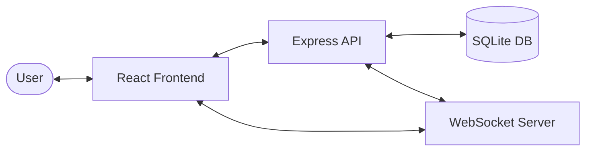
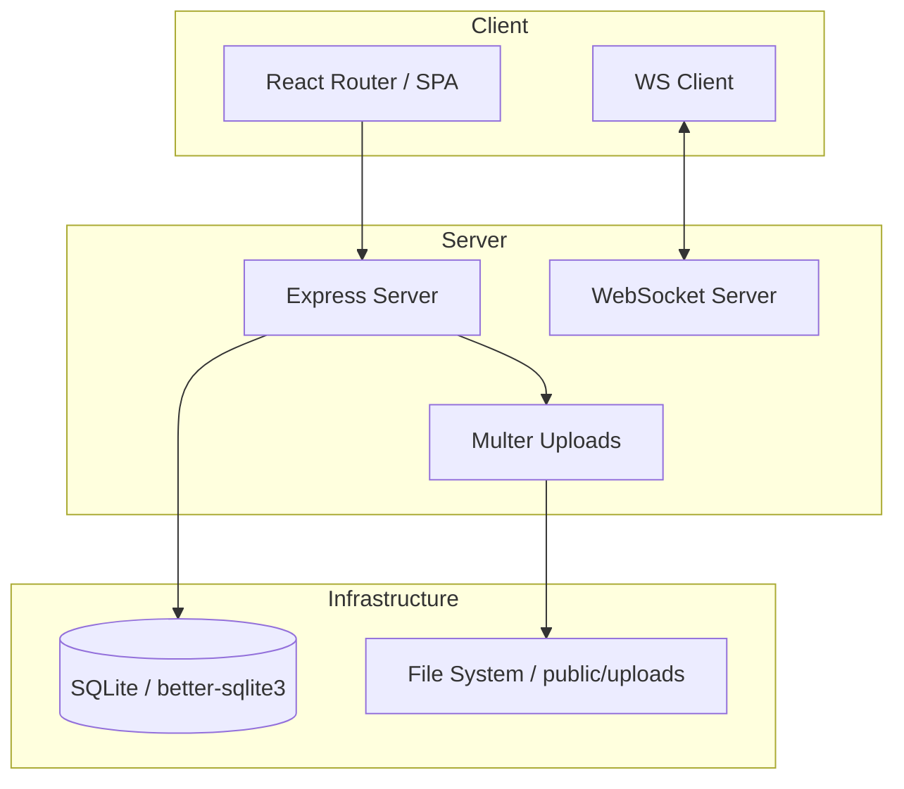
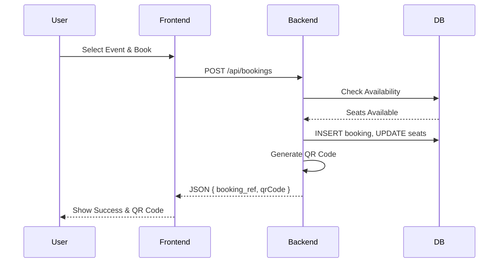
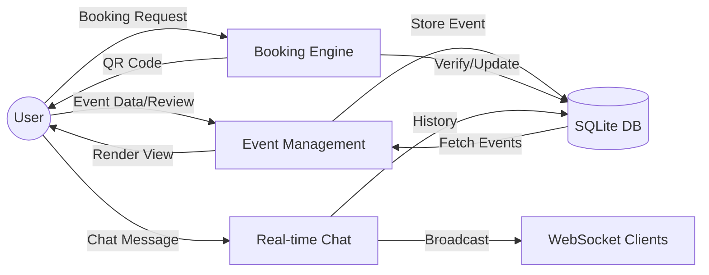
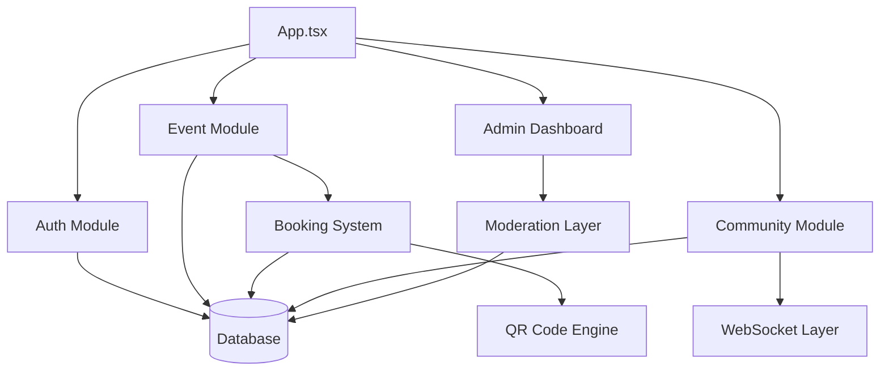

# EventHub

EventHub is a premium event management and community engagement platform designed for campus environments. It streamlines the discovery, hosting, and booking of events while fostering vibrant student communities through real-time interaction and social features.

## Overview
EventHub serves as a centralized hub for all things happening on campus. Whether it's a tech summit, a music festival, or a startup pitch night, EventHub provides the tools for hosts to organize and for students to experience the best moments of campus life.

## Problem Statement
Campus events are often fragmented across different social media platforms, emails, and physical posters, making it difficult for students to discover them and for hosts to manage ticket sales and attendee communication. EventHub solves this by providing:
- A unified platform for event discovery.
- Professional tools for event organizers.
- Real-time community spaces for sustained engagement.

## Key Features

### 👤 Multi-Role User System
- **Students**: Browse events, follow hosts, join communities, and book tickets.
- **Hosts**: Create and manage events, track ticket sales, and verify attendees.
- **Admins**: oversee the platform, approve/reject event submissions, and manage reports.

### 📅 Advanced Event Management
- **Approval Workflow**: All host-created events go through an admin review process.
- **Dynamic Ticket Types**: Support for multiple ticket tiers (e.g., General Admission, VIP).
- **FAQ System**: Hosts can provide event-specific information to potential attendees.

### 🎟️ Seamless Booking & Verification
- **QR Code Generation**: Every booking generates a unique QR code for easy check-in.
- **Seat Management**: Real-time tracking of available seats and sold tickets.

### 🤝 Social & Community Features
- **Communities**: Interest-based groups where users can post updates and chat.
- **Real-time Messaging**: WebSocket-powered community chat for live interaction.
- **Follow System**: Users can follow their favorite hosts and friends.

### 🛡️ Moderation & Reporting
- **Report System**: Users can report suspicious or inappropriate events.
- **Admin Dashboard**: Centralized panel for managing pending events and user reports.

## Tech Stack

### Frontend
- **React 19**: Modern UI library for building dynamic components.
- **Tailwind CSS 4**: Next-generation utility-first CSS framework for premium aesthetics.
- **Motion**: For smooth, high-end micro-animations and transitions.
- **React Router 7**: Robust routing for a seamless Single Page Application experience.
- **Lucide React**: Sleek, consistent iconography.

### Backend
- **Express / Node.js**: Robust and scalable server infrastructure.
- **tsx**: Modern TypeScript execution environment.

### Database
- **SQLite (better-sqlite3)**: Fast, reliable, and lightweight relational database.

### Real-time & Utilities
- **WebSocket (ws)**: Enables real-time messaging in communities.
- **QRCode**: Generates scannable codes for ticket verification.
- **Multer**: Handles secure file and image uploads.
- **UUID**: Ensures unique identification for all system entities.
- **Google Generative AI**: Infrastructure ready for AI-enhanced features.

## System Architecture

EventHub follows a modern Client-Server architecture:
1. **Frontend**: A React-based SPA that communicates with the API via JSON.
2. **Backend**: An Express server handling business logic, authentication, and WebSocket connections.
3. **Database**: A relational SQLite database for persistence, managed via `better-sqlite3`.



## Installation Guide

Follow these steps to set up the project locally:

1. **Clone the repository**:
   ```bash
   git clone <repository-url>
   cd event-hub
   ```

2. **Install dependencies**:
   ```bash
   npm install
   ```

3. **Set up Environment Variables**:
   Create a `.env` file in the root based on `.env.example`.

4. **Start the development server**:
   ```bash
   npm run dev
   ```
   The application will be available at `http://localhost:3000`.

## Usage Guide

1. **Discovery**: Use the home page or search bar to find events by name, category, or venue.
2. **Authentication**: Register as a student or host. Roles determine your access to specific dashboards.
3. **Booking**: Select an event, choose your ticket type, and confirm. Your QR code will be available in "My Bookings".
4. **Community**: Join interest groups, participate in discussions, and message other members in real-time.
5. **Hosting**: If you are a host, use the "Host Dashboard" to create events. Wait for admin approval to see them go live.

## Folder Structure

```text
event-hub/
├── public/          # Static assets and user uploads
├── src/             # Frontend source code
│   ├── App.tsx      # Main application logic and routing
│   ├── main.tsx     # Entry point
│   ├── types.ts     # TypeScript definitions
│   └── index.css    # Global styles (Tailwind v4)
├── db.ts            # Database schema and initialization
├── server.ts        # Express server and API routes
├── events.db        # SQLite database file
└── package.json     # Project dependencies and scripts
```

## Configuration
The project uses the following configuration files:
- `vite.config.ts`: Vite build and server settings.
- `tsconfig.json`: TypeScript compiler configuration.
- `.env`: Environment variables for sensitive configuration.

## Future Improvements
- **Payment Integration**: Support for real-world transactions via Stripe or Razorpay.
- **Cloud Storage**: Transitioning from local `/uploads` to AWS S3 or Google Cloud Storage.
- **AI Recommendations**: Personalized event suggestions using user behavior and preferences.
- **JWT Authentication**: Moving beyond session-like identification for improved security.

---

## Workflow & Algorithm Documentation

### Main Booking Workflow
1. **Selection**: User selects an event and ticket type.
2. **Availability Check**: System verifies `available_seats` in the `events` table.
3. **Transaction**:
   - `INSERT` record into `bookings` table.
   - `UPDATE` `ticket_types` to increment `sold`.
   - `UPDATE` `events` to decrement `available_seats`.
4. **Verification Generation**: System generates a unique `booking_ref` and converts it into a Base64 QR Code using the `qrcode` library.

### Real-time Messaging Algorithm
1. **Connection**: Frontend establishes a WebSocket connection with the `communityId` and `userId`.
2. **Storage**: Server stores client connections in a `Map<string, Set<WebSocket>>` keyed by `communityId`.
3. **Transmission**: When a message is posted to `/api/communities/:id/messages`:
   - It is saved to the database.
   - The server retrieves all WebSocket clients for that `communityId`.
   - The message is broadcasted to all active clients in that set.

---

## System Diagrams

### System Architecture Diagram


### Application Workflow Diagram


### Data Flow Diagram (DFD)


### Module Interaction Diagram

