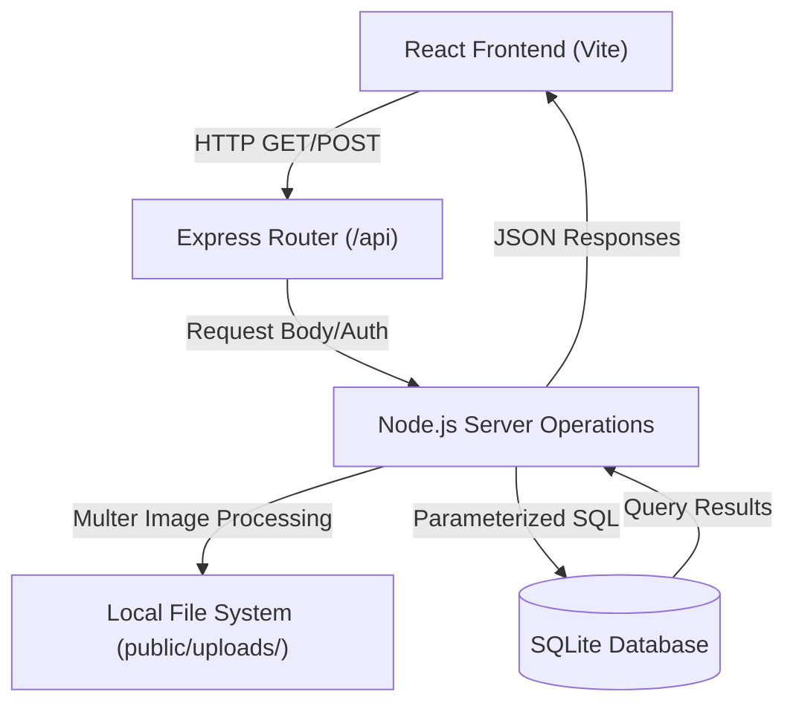
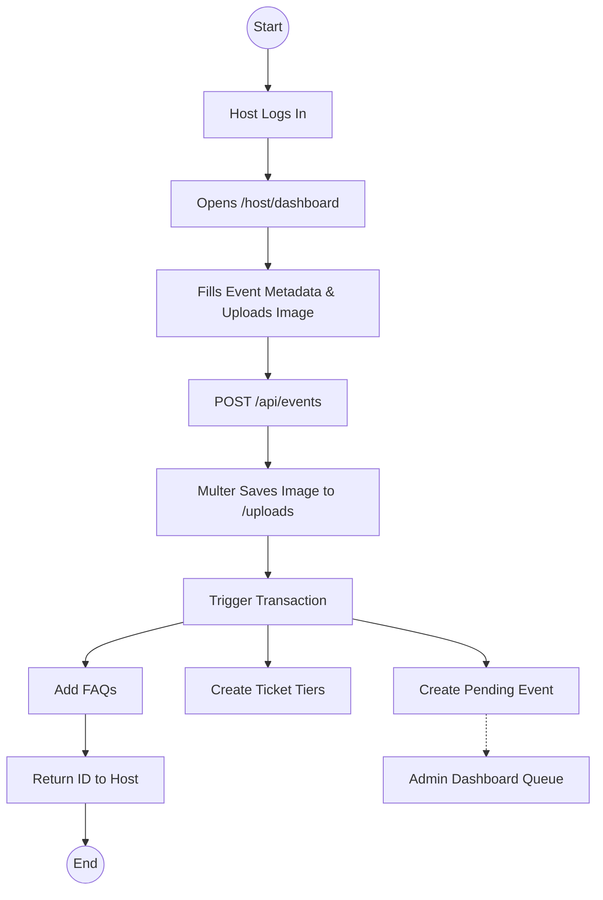
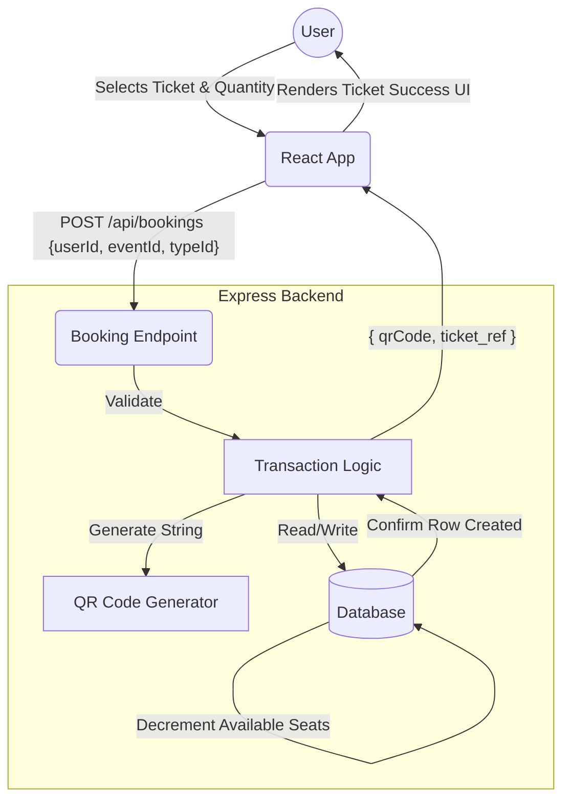
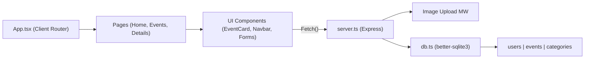

# EventHub Comprehensive Documentation

This document contains a complete technical analysis, repository map, professional README, business workflows, algorithms, and system diagrams for the **EventHub** project.

---

## PHASE 1: FULL CODEBASE ANALYSIS

### Project Type
**Full Stack Web Application**

### Technology Stack
- **Frontend**
  - Language: TypeScript 
  - Framework: React 19 (Functional Components, Hooks)
  - Routing: React Router 7 (`react-router-dom`)
  - Styling: Tailwind CSS 4, Vanilla CSS (`index.css`)
  - Animations: Motion (Framer Motion)
  - Icons: Lucide React
  - Build Tool: Vite 6

- **Backend**
  - Language: TypeScript (executed via `tsx` / Node.js)
  - Framework: Express.js
  - API Architecture: REST
  - Database: SQLite (via `better-sqlite3`)
  - File Uploads: Multer (stores to `public/uploads`)
  - Utilities: `uuid` (for string-based Unique IDs), `qrcode` (for ticket generation)

### System Architecture
- **Entry Points:** 
  - Backend: `server.ts` handles Express middleware, REST API routing, and serves the Vite frontend in development.
  - Frontend: `src/main.tsx` bootstrapping the React application, rendering `App.tsx`.
- **Core Modules:**
  - **Auth System:** Foundational roles (Student, Host, Admin). Simple token-less context currently based on basic responses.
  - **Event Management:** Event CRUD, Categorization, Searching, Filtering.
  - **Ticketing & Booking:** Booking tracking, total available seats, QR code ticket generation, Ticket Types (General, VIP).
  - **Engagement Layer:** Reviews, Ratings, Discussions, FAQs, Reporting.
- **Data Layer:** `db.ts` uses `better-sqlite3` to manage schemas and seed test data. The database operates synchronously.
- **UI Layer:** Found inside `src/App.tsx`, containing modular functional components (`EventCard`, `ReviewForm`, `Navbar`, Route Pages like `Home`, `Events`, `Profile`, `EventDetails`). 

### Business Logic & Workflows
- **Request Lifecycle:** Requests land on `server.ts` Express routes, directly interface with SQLite via `db.prepare()`, and return JSON data.
- **Authentication Flow:** User logs in via POST `/api/auth/login`, receives a user object without the password, which the React frontend stores in state to manage `user` sessions.
- **Event Lifecycle:**
  - A **Host** creates an event (status: `pending`).
  - An **Admin** reviews the event on the Admin Dashboard and transitions the status to `approved` or `rejected`.
  - Approved events display on the public feed.
  - Users book tickets, system decrements `available_seats`, increments `sold` tickets, and generates a base64 QR Code string for the booking reference.

---

## PHASE 2: REPOSITORY STRUCTURE MAPPING

### Folder Hierarchy Tree

```text
event-hub/
├── .env.example
├── .gitignore
├── db.ts
├── events.db
├── index.html
├── metadata.json
├── package.json
├── README.md
├── server.ts
├── tsconfig.json
├── vite.config.ts
├── public/
│   └── uploads/
└── src/
    ├── App.tsx
    ├── index.css
    ├── main.tsx
    └── types.ts
```

### Directory Analysis

#### `event-hub/` (Root)
- **Purpose**: The core application root containing module definitions, build configuration, and backend initialization logic.
- **Key Files**: 
  - `server.ts`: The Express backend implementation containing all API routes and Vite middleware integration.
  - `db.ts`: Defines the SQLite schema, migrates the tables, and seeds the test users (`admin-id`, `host-id`, `student-id`) and mockup events.
  - `package.json`: Defines Node dependencies, scripts (`npm run dev`, `build`), and the module type.
  - `vite.config.ts`: Vite frontend bundler and Tailwind CSS configuration.
- **Usage Notes**: Developers run `npm install` and `npm run dev` from this folder to launch the unified full-stack server.

#### `public/`
- **Purpose**: A directory intended to serve static assets directly to the browser, bypassing the Vite pipeline.
- **Key Files**: 
  - `uploads/`: Contains user-uploaded images (event banners) processed by Multer in the backend. 
- **Dependencies**: The backend relies on this folder for persistent local image storage. 
- **Usage Notes**: When testing locally, ensure the backend has write access so images don't fail to upload.

#### `src/`
- **Purpose**: The front-end React source directory containing all UI code, styles, and type definitions.
- **Key Files**: 
  - `main.tsx`: React DOM rendering entry point.
  - `App.tsx`: The primary container file. It holds the App router, context providers, navigation `Navbar`, global UI components, and all Page/View components.
  - `index.css`: Stores global base styles, design tokens, and imported Tailwind rules.
  - `types.ts`: Central location for TypeScript generic interfaces (User, Event, Category) for robust prop drilling.
- **Dependencies**: Inherits styles from Tailwind Vite plugin. Relies precisely on backend JSON shapes defined in `types.ts`.
- **Usage Notes**: Developers building new UI screens should define them as components inside `App.tsx` (or split into subfolders as the project grows) and declare their corresponding routes.

---

## PHASE 3: COMPLETE README.md GENERATION

*(The following is a fully generated, GitHub-ready `README.md` representation)*

```markdown
# EventHub 🎫

## Overview
EventHub is a modern, high-performance campus event marketplace designed for students and event organizers. It provides a seamless platform for discovering campus happenings, booking VIP or general tickets, and managing large-scale events with real-time host and admin dashboards.

## Problem Statement
University students often struggle to find engaging events on campus due to fragmented communication channels (flyers, emails, various social media). Event organizers lack a unified platform to sell varied ticket tiers, track attendance, respond to FAQs, and gather reviews. EventHub bridges this gap with an intuitive, centralized ecosystem.

## Key Features

- **Multi-Role Authentication**
  - *Description*: Users exist as Students, Hosts, or Admins.
  - *Internal Workings*: Backed by a SQLite role check. React selectively renders dashboards based on `user.role`.

- **Event Discovery & Filtering**
  - *Description*: Search events by name, date, venue, or mood (category).
  - *Internal Workings*: Dynamic SQL querying in Node.js filters dates, category IDs, and wildcard matches for venues, sorted by date in ascending order.

- **Automated QR Event Ticketing**
  - *Description*: Every successful booking generates a unique ticket reference and QR Code.
  - *Internal Workings*: The backend utilizes `uuid` and the `qrcode` library to generate a data URL representation of the booking reference, stored against the user's booking record.

- **Admin Approval Engine**
  - *Description*: To maintain quality, newly created events sit in a `pending` status. Admins approve or reject them.
  - *Internal Workings*: A dedicated dashboard queries `WHERE status = 'pending'`, sending `UPDATE` statements to approve or block visibility. Users can also trigger moderation via a "Report Event" flow.

- **Review & Rating System**
  - *Description*: Attendees can leave verified 1-to-5 star ratings and reviews on events.
  - *Internal Workings*: Form submissions post to `/api/reviews`. The DB has a `UNIQUE(user_id, event_id)` constraint to prevent duplicate reviews by the same user.

## Tech Stack
- **Frontend**: React 19, Tailwind CSS 4, Motion, Lucide React
- **Backend**: Node.js, Express.js, TypeScript
- **Database**: SQLite (`better-sqlite3`)
- **Tools**: Vite 6, tsx, Multer

## System Architecture
EventHub uses a unified monolith architecture where a single Node/Express server both handles RESTful API requests and dynamically serves the React single-page application via Vite middleware in development (and static files in production). The architecture heavily utilizes immediate synchronous SQLite transactions for atomic data integrity (e.g., booking a ticket and decrementing seat availability simultaneously).

## Installation Guide

### Prerequisites
- Node.js v18 or newer
- Terminal/Git

### Instructions
1. **Clone the repo**
   \`\`\`bash
   git clone https://github.com/your-org/event-hub.git
   cd event-hub
   \`\`\`
2. **Install dependencies**
   \`\`\`bash
   npm install
   \`\`\`
3. **Set Environment Variables**
   \`\`\`bash
   cp .env.example .env
   \`\`\`
4. **Run the Development Server**
   \`\`\`bash
   npm run dev
   \`\`\`
   *(Server and Database auto-initialize and spin up on port 3000)*

## Usage Guide
Navigate to \`http://localhost:3000\`.
- As a **Student**: Browse events, view an event's details to see FAQS/Reviews, book a ticket, and log in to view the QR code in your profile.
- As a **Host**: Sign in to access your dashboard, click "Create Event", upload a banner, define ticket packages, and await Admin approval.
- As an **Admin**: View the Admin Panel to approve reported users, dismiss false reports, or green-light pending collegiate events.

### Test Credentials
| Role | Email | Password |
| :--- | :--- | :--- |
| **Admin** | \`admin@eventhub.com\` | \`admin123\` |
| **Host** | \`host@eventhub.com\` | \`host123\` |
| **Student** | \`student@eventhub.com\` | \`student123\` |

## Folder Structure
- \`src/\`: React frontend codebase.
- \`public/uploads/\`: Locally hosted event banners.
- \`db.ts\`: Core SQLite table definitions and seed logic.
- \`server.ts\`: Express API controller maps.

## Configuration
- **Environment variables**: Use \`.env\` for keys like \`GEMINI_API_KEY\` (if extending AI functionality).
- **SQLite Database**: Automatically configured to \`events.db\` located within the root directory upon server initialization.

## Deployment
This app can be deployed linearly on generic VPS platforms (Render, DigitalOcean, Heroku).
1. Build frontend: \`npm run build\`
2. Set production env: \`NODE_ENV=production\`
3. Run: \`npm start\`
*Note: Using a managed disk volume is required to persist the \`events.db\` and \`public/uploads/\` data across server restarts.*

## Future Improvements
- **Decoupled Frontend**: Split React code into multiple route files instead of a large \`App.tsx\` for better code splitting.
- **Relational Shift**: Migrate from SQLite to PostgreSQL if scale demands concurrent high-volume writes.
- **Auth Hardening**: Implement JWT middleware, session cookies, and bcrypt password hashing.

## Contributing Guidelines
1. Do not push to \`main\` directly. 
2. Use descriptive branch names (\`.e.g, feature/login-update\`).
3. Run \`npm run lint\` before opening a Pull Request.
4. If altering the DB schema, ensure you update the teardown/setup blocks in \`db.ts\`.

```

---

## PHASE 4: WORKFLOW & ALGORITHM DOCUMENTATION

### System Workflow
**Event Booking Lifecycle:**
1. User requests to view `/events/:id`. 
2. Frontend fetches aggregate event details, FAQs, Ticket Types, and Reviews.
3. User selects a ticket type (e.g., "VIP Experience", Quantity: 2) and clicks Book.
4. Frontend sends a `POST /api/bookings` JSON payload.
5. Server verifies constraints, generates a random alphanumeric booking reference `EVT-{random}`.
6. Server uses `QRCode.toDataURL()` to transform the reference into a scannable Base64 image payload.
7. Server wraps three SQL queries in a transaction: a) Insert Booking, b) Increment Ticket Type Sold count, c) Decrement Global Event Seats.
8. Server returns the unique Ticket ID and generated QR Code for immediate UI rendering.

### Algorithms
**Atomic Database Transactions**
EventHub implements safe ACID transactional blocks using `db.transaction()` around booking paths and deletion cascades.
*Logic:* If any SQL query within the booking cascade fails (e.g., out of seats, foreign key crash), the entire transaction rolls back, preventing ghost tickets or desynchronized data states.

**Dynamic Event Quering**
The search algorithm acts as an aggregating `WHERE` string builder.
*Logic:*
- Initialize base string: `SELECT * FROM events ... WHERE status = 'approved'`
- If `req.query.category` exists, append `AND e.category_id = ?`, parameterizing the data.
- If `req.query.startDate` exists, append `AND e.date >= ?`.
- Execute with flat array `...params`. This prevents SQL injection while allowing completely adaptable, highly variable filter permutations from the clients.

### Data Flow Explanation
1. **Client Action:** The user updates a React input state. Form submit triggers `fetch()`.
2. **Controller (Express):** Receives Node request. Validates body shape (`req.body`).
3. **Database execution:** Express triggers `db.prepare().run()`.
4. **Response Delivery:** Execution succeeds; Node passes aggregate JSON back. React state resets error boundaries, transitions animations, and reveals data.

### Component Interaction
**Parent-to-Child Navigation:**
The primary `App.tsx` handles Top-Level State (`user`). Components like `Navbar` receive `user` and `onLogout` via props. Pages receive `user` to conditionally render secured pathways (like the Booking trigger, or navigating unauthenticated users back to login).

---

## PHASE 5: DIAGRAM GENERATION

### 1. System Architecture Diagram



### 2. Application Workflow Diagram (Event Creation)



### 3. Data Flow Diagram (DFD) - Booking Ticketing



### 4. Module Interaction Diagram



---

